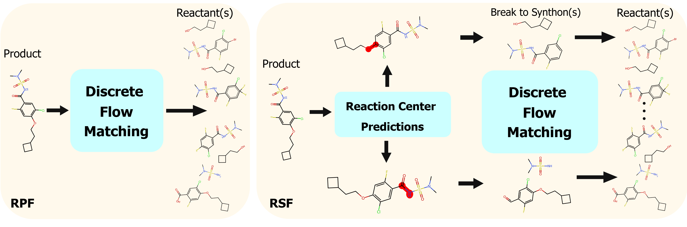

# RetroSynFlow: Discrete Flow Matching for Accurate and Diverse Single-Step Retrosynthesis

The official implementation of NeurIPS 2025 paper named "RetroSynFlow: Discrete Flow Matching for Accurate and Diverse Single-Step Retrosynthesis". 

## Overview


We propose a discrete flow matching framework for retrosynthesis that incorporates synthons and inference time reward-based steering. 


## Installation

**Step 1:** Create a python environment.

```
conda create --name retroflow python=3.10 -y
conda activate retroflow 
```

**Step 2:** Install the required packages.

```
pip install -r main.txt -r pytorch.txt -r other.txt
```

**Step 3:** Install the retflow library by running the following command in the main directory. 

```
pip install -e .
```

**Step 4:** Set environment variables. Use SETX on windows instead of export. 

```
export RETRO_WORKSPACE=~/workspace
```

Datasets and experiment logs + results will be saved to the workspace directory. Pretrained-model such as the Molecular Transformer forward-synthesis model and the reaction-center identification model should be placed in `~/workspace/models/`. 


```
export RETRO_WANDB_ENABLE=true
export RETRO_WANDB_MODE=offline
export RETRO_WANDB_PROJECT=testing
export RETRO_WANDB_ENTITY=wandb_entity
```

If you are not using wandb then set '''RETRO_WANDB_ENABLE=False'''. 

## API Example

The retflow library provides an API to define and run experiments and evaluate models for retrosynthesis. 

In a few lines of code, you can train a flow matching model to transport product -> reactants. 

```
from retflow import (ADAMW, Experiment, GraphDiscreteFM, GraphTransformer,
                     RetroDataset, Retrosynthesis)
from retflow.runner import cli_runner, slurm_config

model = GraphTransformer()
dataset = RetroDataset(name="USPTO", batch_size=32)
method = GraphDiscreteFM()

experiment = Experiment(
    problem=Retrosynthesis(model, dataset, method),
    optim=ADAMW,
    epochs=300,
    sample_epoch=25,
    num_samples=128,
    examples_per_sample=5,
    seed=42,
    group="discrete_fm_product",
    name="baseline",
)

if __name__ == "__main__":
    cli_runner([experiment], slurm_config.DEFAULT_3_GPU_46H)
```

To train this flow matching model locally:

```
python [experiment_file].py --local
```

To automatically submit a slurm job on a cluster

```
python [experiment_file].py --slurm
```
The checkpoints and logs for this experiment are automatically saved to `~/workspace/experiments/{group}/{name}`. 

Evaluation is also simple:


```
from retflow.experiment_eval import ExperimentEvaluator
from retflow.runner import cli_runner, slurm_config
from [experiment_file] import experiment

experiment_eval = ExperimentEvaluator(
    experiment=experiment,
    test_method=experiment.problem.method,
    examples_per_sample=100,
    checkpoint_name="model_epoch_300.pt",
    output_name=f"linear_100_reactants",
)


if __name__ == "__main__":
    cli_runner([experiments_eval], slurm_config.DEFAULT_GPU_32H)
```

Run the following command to evaluate the model saved at epoch 300 with 100 reactants generated per product.  

```
python [experiment_eval_file].py --local
```

To automatically submit a slurm job on a cluster

```
python [experiment_eval_file].py --slurm
```


## Synthon Completion

First, train a reaction center identification model using the `train_g2g.ipynb` notebook which should take ~15 minutes. 

In a few lines of code we can train a flow matching model for synthon -> reactants,

```
from retflow import (ADAMW, Experiment, GraphDiscreteFM, GraphTransformer,
                     SynthonCompletion, SynthonDataset)
from retflow.runner import cli_runner, slurm_config

model = GraphTransformer()
dataset = SynthonDataset(name="SynthonUSPTO", batch_size=32 * 3)
method = GraphDiscreteFM()

experiment = Experiment(
    problem=SynthonCompletion(model, dataset, method, use_product_context=True),
    optim=ADAMW,
    epochs=800,
    sample_epoch=100,
    num_samples=128,
    examples_per_sample=5,
    seed=42,
    group="discrete_fm_synthon_completion",
    name="product_context",
)

if __name__ == "__main__":
    cli_runner([experiment], slurm_config.DEFAULT_3_GPU_46H)
```

Two run two stage retrosynthesis using the pretrained reaction center model and the trained flow matching model, run the following file

```
cd retflow/src/exps/
python discrete_fm/synthon/synthon_product_retro_eval.py --local
```


## Experiments

All other experiment files with ablations are located in the `retflow/src/exps/` folder. 


## Citation

If you find this work useful, please consider citing:


```
@article{yadav2025retrosynflow,
      title={RetroSynFlow: Discrete Flow Matching for Accurate and Diverse Single-Step Retrosynthesis},
      author={Yadav, Robin and Yan, Qi and Wolf, Guy and Bose, Joey and Liao, Renjie},
      journal={arXiv preprint arXiv:2506.04439},
      year={2025}
    }
```